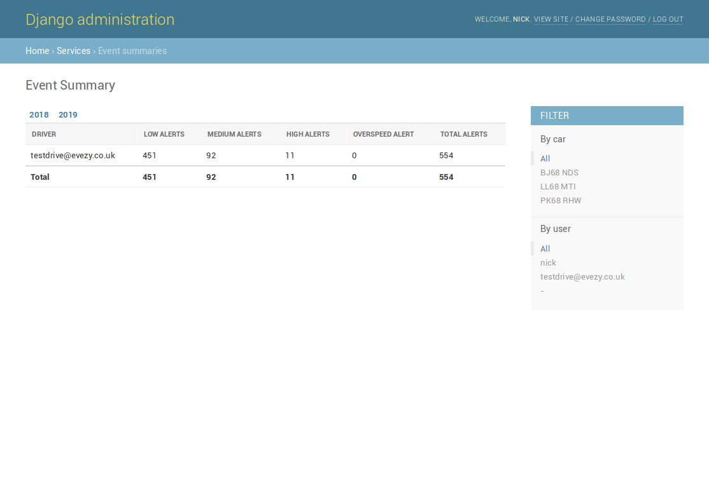
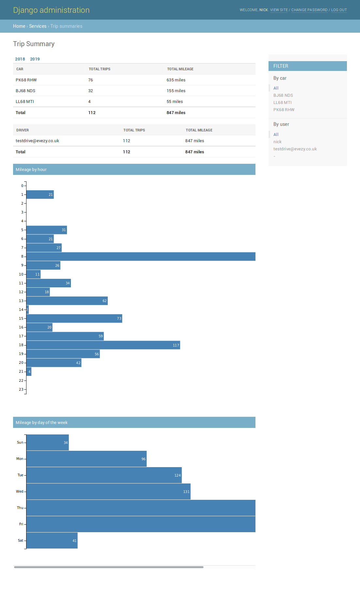

# testdrive.evezy.co.uk
This is a small extract of the backend that runs on https://drive.evezy.co.uk. It contains enough model structure to provide a rudimentary booking system however the key section we would like you to work on involves car telematics, namely Event and Trip data. We have provided a working admin system and would like you to fill in the blanks where code is missing so that the pages match the screenshots provided.

## Project Execution
To begin with, please create a virtual environment and install the requirements as follows:

```pip install -r rvme/requirements/local.txt```

Then please create yourself a superuser and run the project as you would any other.

## Project Structure
The majority of the code is contained within the folder "rvme". This stands for rentE Vehicle Management Engine and in the live site it is a shared repository between EVezy and its parent company [rentE](https://www.rentecars.co.uk).

The booking system is contained within ```rvme.bookings``` and the telematics models can be found in ```rvme.services.surecam```. The data from these models is then used to create 2 summary pages in the Django Admin, via 2 proxy models in ```rvme.services```. 

## Exercise Tasks
We would like you to fill in the missing parts of the code used to generate these 2 summary pages. Both summary pages utilise Django's [date_hierarchy](https://docs.djangoproject.com/en/1.11/ref/contrib/admin/#django.contrib.admin.ModelAdmin.date_hierarchy) so should be date-filterable and this has been already set up for you. The summary page contents are as follows:   
- Event Summaries: The telematics data contains Events, the various types of which can be seen in ```rvme.services.surecam.constants```. This page should contain a list of each driver and their **low**, **medium**, **high**, **overspeed** and **total** (of those types) alerts for whichever date period the page is currently displaying, plus the total for all drivers.

- Trip Summaries: This page contains summarised Trip data over the date period selected, broken down into 4 sections:
  - A table of the Trips made by each driver
  - A table of the Trips made by each car 
  - A graph showing hours of the day when Trips are made
  - A graph showing days of the week when Trips are made


The code to generate these tables and graphs are all in place already, we just need you to fill in the blanks in the backend source code. The file you will be editing is ```rvme.services.admin``` and within that file you can see **4 TODO items**, each with a brief explanation and the expected output.

Please make your way through as many of the TODOs as you can, we would suggest you set a maximum of 3 hours and don't worry if you don't finish them all. You will need to work through them in order, as some parts may not be completable without previous sections. They should also get slightly harder as your progress.

If you have any questions please don't hesitate to email [nick@evezy.co.uk](nick@evezy.co.uk).

Thank You 